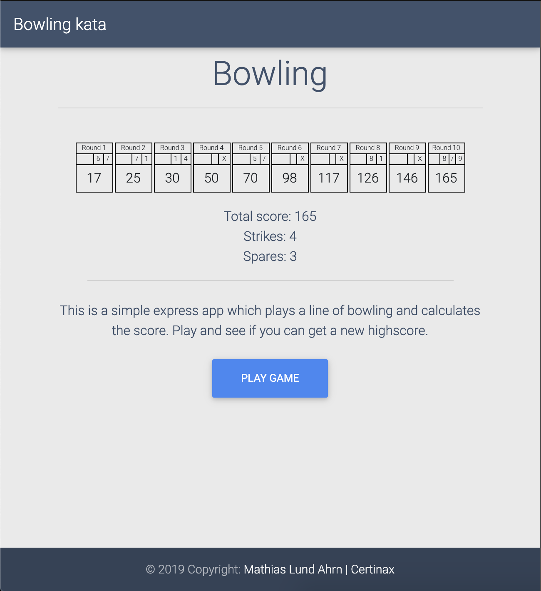

# Codekata Bowling

Simple node/express app using handlebars to provide a set of scores for a bowling game.

This was used as a technical task for an interview with Sparebank 1 Utvikling, February 28th 2020.

Hosted on heroku: https://certinax-bowling.herokuapp.com/

Source: [Description](http://codingdojo.org/kata/Bowling/?fbclid=IwAR096crcPVXYAmO5nRrwEDmMBFkAETQy7mEFXwS_E0ID_0vmlg34mPygBkA)
